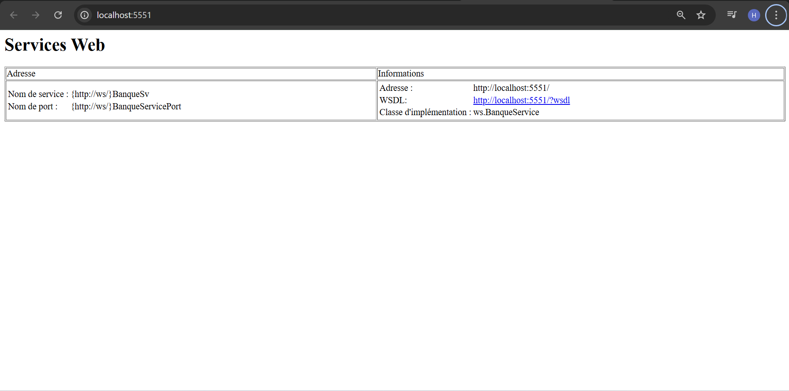
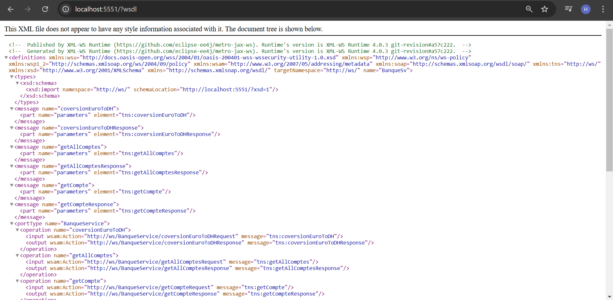

<!--<h2>Test du Web service</h2>

<h2>Web services SOAP WSDL</h2>

<h2>Web services SOAP XSD</h2>

<h2>Test des Methods avec SOAP_UI</h2>

<h2>Consommation du Web service</h2>

<h2>Architecture</h2>
-->
# Documentation des Web Services SOAP

Ce document présente les étapes de test, d'intégration et de consommation des Web Services SOAP, accompagnées de captures d'écran illustratives.

---

## Test du Web Service
Voici un aperçu de la procédure de test effectuée pour valider les fonctionnalités du Web Service.

---

## Web Services SOAP - WSDL
L'interface WSDL du Web Service détaille les opérations disponibles et les messages échangés. Voici une vue de cette interface.

---

## Web Services SOAP - XSD
Le fichier XSD définit la structure des données échangées dans le Web Service.

---

## Test des Méthodes avec SOAP UI
Les tests des méthodes du Web Service ont été effectués à l'aide de l'outil SOAP UI pour valider leur bon fonctionnement.

### Test de la méthode 1 :

### Test de la méthode 2:

### Test de la méthode 3 :

---

## Consommation du Web Service
Le Web Service a été consommé dans une application cliente. Les captures ci-dessous illustrent cette intégration.

---

## Architecture
L'architecture globale de l'application, incluant l'intégration des Web Services SOAP, est illustrée ci-dessous.

---

## À propos
- **Technologies utilisées** : Web Services SOAP, WSDL, XSD, SOAP UI.
- **Objectif** : Fournir un guide visuel pour tester et consommer les Web Services dans une application.

---

Pour toute question ou assistance, n'hésitez pas à contacter le responsable du projet.
